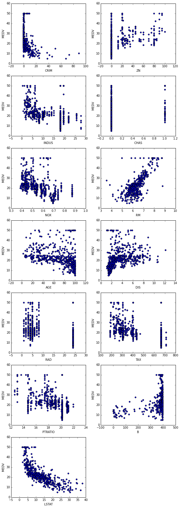
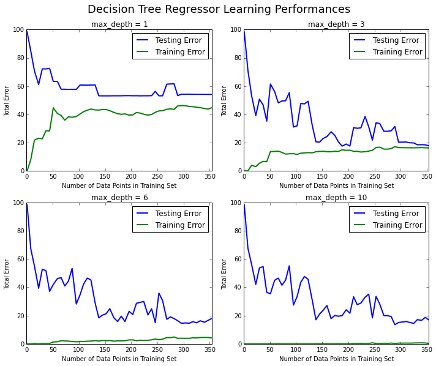
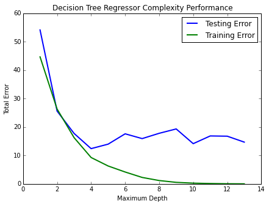

# Machine Learning Engineer Nanodegree
## Model Evaluation & Validation
## Project 1: Predicting Boston Housing Prices

Welcome to the first project of the Machine Learning Engineer Nanodegree! In this notebook, some template code has already been written. You will need to implement additional functionality to successfully answer all of the questions for this project. Unless it is requested, do not modify any of the code that has already been included. In this template code, there are four sections which you must complete to successfully produce a prediction with your model. Each section where you will write code is preceded by a **STEP X** header with comments describing what must be done. Please read the instructions carefully!

In addition to implementing code, there will be questions that you must answer that relate to the project and your implementation. Each section where you will answer a question is preceded by a **QUESTION X** header. Be sure that you have carefully read each question and provide thorough answers in the text boxes that begin with "**Answer:**". Your project submission will be evaluated based on your answers to each of the questions.  

A description of the dataset can be found [here](https://archive.ics.uci.edu/ml/datasets/Housing), which is provided by the **UCI Machine Learning Repository**.

# Getting Started
To familiarize yourself with an iPython Notebook, **try double clicking on this cell**. You will notice that the text changes so that all the formatting is removed. This allows you to make edits to the block of text you see here. This block of text (and mostly anything that's not code) is written using [Markdown](http://daringfireball.net/projects/markdown/syntax), which is a way to format text using headers, links, italics, and many other options! Whether you're editing a Markdown text block or a code block (like the one below), you can use the keyboard shortcut **Shift + Enter** or **Shift + Return** to execute the code or text block. In this case, it will show the formatted text.

Let's start by setting up some code we will need to get the rest of the project up and running. Use the keyboard shortcut mentioned above on the following code block to execute it. Alternatively, depending on your iPython Notebook program, you can press the **Play** button in the hotbar. You'll know the code block executes successfully if the message *"Boston Housing dataset loaded successfully!"* is printed.


```python
# Importing a few necessary libraries
import numpy as np
import matplotlib.pyplot as pl
from sklearn import datasets
from sklearn.tree import DecisionTreeRegressor

# Make matplotlib show our plots inline (nicely formatted in the notebook)
%matplotlib inline

# Create our client's feature set for which we will be predicting a selling price
CLIENT_FEATURES = [[11.95, 0.00, 18.100, 0, 0.6590, 5.6090, 90.00, 1.385, 24, 680.0, 20.20, 332.09, 12.13]]

# Load the Boston Housing dataset into the city_data variable
city_data = datasets.load_boston()

# Initialize the housing prices and housing features
housing_prices = city_data.target
housing_features = city_data.data

print("Boston Housing dataset loaded successfully!")
```

    Boston Housing dataset loaded successfully!


# Statistical Analysis and Data Exploration
In this first section of the project, you will quickly investigate a few basic statistics about the dataset you are working with. In addition, you'll look at the client's feature set in `CLIENT_FEATURES` and see how this particular sample relates to the features of the dataset. Familiarizing yourself with the data through an explorative process is a fundamental practice to help you better understand your results.

## Step 1
In the code block below, use the imported `numpy` library to calculate the requested statistics. You will need to replace each `None` you find with the appropriate `numpy` coding for the proper statistic to be printed. Be sure to execute the code block each time to test if your implementation is working successfully. The print statements will show the statistics you calculate!


```python
# Number of houses in the dataset
total_houses = len(housing_prices)

# Number of features in the dataset
total_features = len(housing_features[0])

# Minimum housing value in the dataset
minimum_price = min(housing_prices)

# Maximum housing value in the dataset
maximum_price = max(housing_prices)

# Mean house value of the dataset
mean_price = np.mean(housing_prices)

# Median house value of the dataset
median_price = np.median(housing_prices)

# Standard deviation of housing values of the dataset
std_dev = np.std(housing_prices)

# Show the calculated statistics
print("Boston Housing dataset statistics (in $1000's):\n")
print("Total number of houses:", total_houses)
print("Total number of features:", total_features)
print("Minimum house price:", minimum_price)
print("Maximum house price:", maximum_price)
print("Mean house price: {0:.3f}".format(mean_price))
print("Median house price:", median_price)
print("Standard deviation of house price: {0:.3f}".format(std_dev))
```

    Boston Housing dataset statistics (in $1000's):
    
    Total number of houses: 506
    Total number of features: 13
    Minimum house price: 5.0
    Maximum house price: 50.0
    Mean house price: 22.533
    Median house price: 21.2
    Standard deviation of house price: 9.188


## Question 1
As a reminder, you can view a description of the Boston Housing dataset [here](https://archive.ics.uci.edu/ml/datasets/Housing), where you can find the different features under **Attribute Information**. The `MEDV` attribute relates to the values stored in our `housing_prices` variable, so we do not consider that a feature of the data.

*Of the features available for each data point, choose three that you feel are significant and give a brief description for each of what they measure.*

Remember, you can **double click the text box below** to add your answer!

**Answer: **

To find most significant features let's just draw scatter plot for each feature. Most significant features will show strong correlation between feature value and house's price. As you can see below, features with strongest correlation are:

* CRIM: How criminal house's location is. The more location is criminal,the cheaper dwelling is.
* RM: Average number of rooms per dwelling. And again. Although there are some outliers with highest price, there is a strong positive correlation between amount of rooms and dwelling price.
* LSTAT: % lower status of the population 


```python
import matplotlib.pyplot as plt
import pandas as pd

X = pd.DataFrame(city_data.data, columns=city_data.feature_names)
Y = city_data.target

fig = pl.figure(figsize=(10, 30))

for i, column in enumerate(X.columns):
    subplt = fig.add_subplot(7, 2, i+1)
    subplt.scatter(X[column], Y)
    subplt.set_xlabel(column)
    subplt.set_ylabel('MEDV')

fig.show()
```

    /Library/Frameworks/Python.framework/Versions/3.4/lib/python3.4/site-packages/matplotlib/figure.py:387: UserWarning: matplotlib is currently using a non-GUI backend, so cannot show the figure
      "matplotlib is currently using a non-GUI backend, "
    /Library/Frameworks/Python.framework/Versions/3.4/lib/python3.4/site-packages/matplotlib/collections.py:590: FutureWarning: elementwise comparison failed; returning scalar instead, but in the future will perform elementwise comparison
      if self._edgecolors == str('face'):





## Question 2
*Using your client's feature set `CLIENT_FEATURES`, which values correspond with the features you've chosen above?*  
**Hint: ** Run the code block below to see the client's data.


```python
print(CLIENT_FEATURES)
```

    [[11.95, 0.0, 18.1, 0, 0.659, 5.609, 90.0, 1.385, 24, 680.0, 20.2, 332.09, 12.13]]


**Answer: **

[11.95, 5.609, 12.13]

# Evaluating Model Performance
In this second section of the project, you will begin to develop the tools necessary for a model to make a prediction. Being able to accurately evaluate each model's performance through the use of these tools helps to greatly reinforce the confidence in your predictions.

## Step 2
In the code block below, you will need to implement code so that the `shuffle_split_data` function does the following:
- Randomly shuffle the input data `X` and target labels (housing values) `y`.
- Split the data into training and testing subsets, holding 30% of the data for testing.

If you use any functions not already acessible from the imported libraries above, remember to include your import statement below as well!   
Ensure that you have executed the code block once you are done. You'll know the `shuffle_split_data` function is working if the statement *"Successfully shuffled and split the data!"* is printed.


```python
# Put any import statements you need for this code block here
from sklearn import cross_validation
from sklearn import datasets

def shuffle_split_data(X, y):
    """ Shuffles and splits data into 70% training and 30% testing subsets,
        then returns the training and testing subsets. """
    
    # Return the training and testing data subsets
    return cross_validation.train_test_split(X, y, test_size=0.3, random_state=True)


# Test shuffle_split_data
try:
    X_train, X_test, y_train, y_test = shuffle_split_data(housing_features, housing_prices)
    print("Successfully shuffled and split the data!")
except:
    print("Something went wrong with shuffling and splitting the data.")
```

    Successfully shuffled and split the data!


## Question 3
*Why do we split the data into training and testing subsets for our model?*

We use train subset to train our model and test subset to check how accurate it predicts outcome on new data.

## Step 3
In the code block below, you will need to implement code so that the `performance_metric` function does the following:
- Perform a total error calculation between the true values of the `y` labels `y_true` and the predicted values of the `y` labels `y_predict`.

You will need to first choose an appropriate performance metric for this problem. See [the sklearn metrics documentation](http://scikit-learn.org/stable/modules/classes.html#sklearn-metrics-metrics) to view a list of available metric functions. **Hint: ** Look at the question below to see a list of the metrics that were covered in the supporting course for this project.

Once you have determined which metric you will use, remember to include the necessary import statement as well!  
Ensure that you have executed the code block once you are done. You'll know the `performance_metric` function is working if the statement *"Successfully performed a metric calculation!"* is printed.


```python
# Put any import statements you need for this code block here
from sklearn import metrics 


def performance_metric(y_true, y_predict):
    """ Calculates and returns the total error between true and predicted values
        based on a performance metric chosen by the student. """
        
    error = metrics.mean_squared_error(y_true, y_predict)
    return error


# Test performance_metric
try:
    total_error = performance_metric(y_train, y_train)
    print("Successfully performed a metric calculation!")
except:
    print("Something went wrong with performing a metric calculation.")
```

    Successfully performed a metric calculation!


## Question 4
*Which performance metric below did you find was most appropriate for predicting housing prices and analyzing the total error. Why?*
- *Accuracy*
- *Precision*
- *Recall*
- *F1 Score*
- *Mean Squared Error (MSE)*
- *Mean Absolute Error (MAE)*

**Answer**

Predicting Boston Housing Price it's a typicall regression problem. So we suppose to use regression metric there, not the classification's one. From the list above almost all metrics are used to solve classification problems. Only MSE and MAE are used to solve regression problems. MSE always provide highest error rate, because each value is squared and as a result they are always positive. It could be useful when we want emphasizes larger errors over smaller errors. For instance, it makes sense to give more weight to points further away from the mean. When being off by 10 is more than twice as bad as being off by 5 MSE is a more appropriate measure of error. If being off by ten is just twice as bad as being off by 5, then MAE is more appropriate. I think that in this project there is no a big difference between these two metrics. We should use MSE if we are concerned about outliers and their impact on the data.

## Step 4 (Final Step)
In the code block below, you will need to implement code so that the `fit_model` function does the following:
- Create a scoring function using the same performance metric as in **Step 2**. See the [sklearn `make_scorer` documentation](http://scikit-learn.org/stable/modules/generated/sklearn.metrics.make_scorer.html).
- Build a GridSearchCV object using `regressor`, `parameters`, and `scoring_function`. See the [sklearn documentation on GridSearchCV](http://scikit-learn.org/stable/modules/generated/sklearn.grid_search.GridSearchCV.html).

When building the scoring function and GridSearchCV object, *be sure that you read the parameters documentation thoroughly.* It is not always the case that a default parameter for a function is the appropriate setting for the problem you are working on.

Since you are using `sklearn` functions, remember to include the necessary import statements below as well!  
Ensure that you have executed the code block once you are done. You'll know the `fit_model` function is working if the statement *"Successfully fit a model to the data!"* is printed.


```python
# Put any import statements you need for this code block
from sklearn.grid_search import GridSearchCV

def fit_model(X, y):
    """ Tunes a decision tree regressor model using GridSearchCV on the input data X 
        and target labels y and returns this optimal model. """

    # Create a decision tree regressor object
    regressor = DecisionTreeRegressor()

    # Set up the parameters we wish to tune
    parameters = {'max_depth':[1,2,3,4,5,6,7,8,9,10]}

    # Make an appropriate scoring function
    scoring_function = metrics.make_scorer(metrics.mean_squared_error, greater_is_better=False)

    # Make the GridSearchCV object
    reg = GridSearchCV(regressor, parameters, scoring=scoring_function)

    # Fit the learner to the data to obtain the optimal model with tuned parameters
    reg.fit(X, y)

    # Return the optimal model
    return reg.best_estimator_


# Test fit_model on entire dataset
try:
    reg = fit_model(housing_features, housing_prices)
    print("Successfully fit a model!")
except:
    print("Something went wrong with fitting a model.")
```

    Successfully fit a model!


## Question 5
*What is the grid search algorithm and when is it applicable?*

**Answer: **

Grid search it is an exhaustive search algorithm, which looks for an optimal parameters set(unique combination of parameters we passed in) for a prediction model. It uses the estimator object we passed in to instantiate an empty model for every new parameters set, fit this model using K-1 training data, and tests on a left out test data(Here I expect that we use K-Fold Cross Validation). After that, it averages the score for each parameter set over all K-Folds and picks the best parameters set based on the scoring function/criteria we pass in.

## Question 6
*What is cross-validation, and how is it performed on a model? Why would cross-validation be helpful when using grid search?*

**Answer: **

1. As I understand, Cross Validation is the way how we split data into training and testing sets. The advantage of this approach is that we use all data for testing. The idea is following: We split a whole dataset into K splits. One split is for testing and others are for training. We perform this algorithm K times, using one split for testing and rest for training, changing testing spit each time. After operation is completed we take the average of all K results.

2. Cross Validation helps us to train our model with more accurate estimate because a whole dataset is used for both training and testing as oppose to the train/test/split method.

# Checkpoint!
You have now successfully completed your last code implementation section. Pat yourself on the back! All of your functions written above will be executed in the remaining sections below, and questions will be asked about various results for you to analyze. To prepare the **Analysis** and **Prediction** sections, you will need to intialize the two functions below. Remember, there's no need to implement any more code, so sit back and execute the code blocks! Some code comments are provided if you find yourself interested in the functionality.


```python
def learning_curves(X_train, y_train, X_test, y_test):
    """ Calculates the performance of several models with varying sizes of training data.
        The learning and testing error rates for each model are then plotted. """
    
    print("Creating learning curve graphs for max_depths of 1, 3, 6, and 10. . .")

    # Create the figure window
    fig = pl.figure(figsize=(10, 8))

    # We will vary the training set size so that we have 50 different sizes
    sizes = np.rint(np.linspace(1, len(X_train), 50)).astype(int)
    train_err = np.zeros(len(sizes))
    test_err = np.zeros(len(sizes))

    # Create four different models based on max_depth
    for k, depth in enumerate([1, 3, 6, 10]):
        
        for i, s in enumerate(sizes):
            
            # Setup a decision tree regressor so that it learns a tree with max_depth = depth
            regressor = DecisionTreeRegressor(max_depth = depth)
            
            # Fit the learner to the training data
            regressor.fit(X_train[:s], y_train[:s])

            # Find the performance on the training set
            train_err[i] = performance_metric(y_train[:s], regressor.predict(X_train[:s]))
            
            # Find the performance on the testing set
            test_err[i] = performance_metric(y_test, regressor.predict(X_test))

        # Subplot the learning curve graph
        ax = fig.add_subplot(2, 2, k+1)
        ax.plot(sizes, test_err, lw = 2, label = 'Testing Error')
        ax.plot(sizes, train_err, lw = 2, label = 'Training Error')
        ax.legend()
        ax.set_title('max_depth = %s'%(depth))
        ax.set_xlabel('Number of Data Points in Training Set')
        ax.set_ylabel('Total Error')
        ax.set_xlim([0, len(X_train)])
    
    # Visual aesthetics
    fig.suptitle('Decision Tree Regressor Learning Performances', fontsize=18, y=1.03)
    fig.tight_layout()
    fig.show()
```


```python
def model_complexity(X_train, y_train, X_test, y_test):
    """ Calculates the performance of the model as model complexity increases.
        The learning and testing errors rates are then plotted. """
    
    print("Creating a model complexity graph. . . ")

    # We will vary the max_depth of a decision tree model from 1 to 14
    max_depth = np.arange(1, 14)
    train_err = np.zeros(len(max_depth))
    test_err = np.zeros(len(max_depth))

    for i, d in enumerate(max_depth):
        # Setup a Decision Tree Regressor so that it learns a tree with depth d
        regressor = DecisionTreeRegressor(max_depth = d)

        # Fit the learner to the training data
        regressor.fit(X_train, y_train)

        # Find the performance on the training set
        train_err[i] = performance_metric(y_train, regressor.predict(X_train))

        # Find the performance on the testing set
        test_err[i] = performance_metric(y_test, regressor.predict(X_test))

    # Plot the model complexity graph
    pl.figure(figsize=(7, 5))
    pl.title('Decision Tree Regressor Complexity Performance')
    pl.plot(max_depth, test_err, lw=2, label = 'Testing Error')
    pl.plot(max_depth, train_err, lw=2, label = 'Training Error')
    pl.legend()
    pl.xlabel('Maximum Depth')
    pl.ylabel('Total Error')
    pl.show()
```

# Analyzing Model Performance
In this third section of the project, you'll take a look at several models' learning and testing error rates on various subsets of training data. Additionally, you'll investigate one particular algorithm with an increasing `max_depth` parameter on the full training set to observe how model complexity affects learning and testing errors. Graphing your model's performance based on varying criteria can be beneficial in the analysis process, such as visualizing behavior that may not have been apparent from the results alone.


```python
learning_curves(X_train, y_train, X_test, y_test)
```

    Creating learning curve graphs for max_depths of 1, 3, 6, and 10. . .


    /Library/Frameworks/Python.framework/Versions/3.4/lib/python3.4/site-packages/matplotlib/figure.py:387: UserWarning: matplotlib is currently using a non-GUI backend, so cannot show the figure
      "matplotlib is currently using a non-GUI backend, "





## Question 7
*Choose one of the learning curve graphs that are created above. What is the max depth for the chosen model? As the size of the training set increases, what happens to the training error? What happens to the testing error?*

**Answer: **

* The max depth of chosen model is 3. 
* As size of the training set increases, training error increases. But after our model got trained enough, training error has ceased to grow. On the graph it happens when size of training set comes close to 150 entries. On graphs with higher `max_depth` we see that training rate is lower. But the reason why graph with `max_depth=3` is better is because its training error quite close to testing error which means lower variance. And low variance means that our model well generalizes on both training and testing data. 
* The value of testing error decreases as more data we used to train our model. But at the moment when number of data points which we used to train our model came close to 150, our model got trained enough and testing error has stopped approximately at one level, as same as the testing error curve. There are also big waves on a testing error curve, which are the result of MSE performance metric we use to calculate errors. If we are less concerned about errors on outliers, the MAE performance metric may be used.

## Question 8
*Look at the learning curve graphs for the model with a max depth of 1 and a max depth of 10. When the model is using the full training set, does it suffer from high bias or high variance when the max depth is 1? What about when the max depth is 10?*

**Answer: **

* If max depth is 1, our model suffer from high bias. As the result we see extremely high error on a training set. This happends when our model is oversimplified and we don't pay enough attention on all features of the dataset. 

* But if max depth of our model is equal to 10, our model becomes overfitted and it suffers from high variance. As the result, much higher error on testing set than on training set. This happends because we tried to pay attention on every feature, so our model became adaptated only to training set. Although testing error remains almost same when we increase depth of our model, it is not a good idea to use all features because complexity of fitting a model growth exponentially.


```python
model_complexity(X_train, y_train, X_test, y_test)
```

    Creating a model complexity graph. . . 





## Question 9
*From the model complexity graph above, describe the training and testing errors as the max depth increases. Based on your interpretation of the graph, which max depth results in a model that best generalizes the dataset? Why?*

**Answer: **

On the graph above we see that as max depth increases, both testing error and training error decrease. 

Although the max_depth at the beginning is low, the difference between testing and is quite small, which means low variance on a data set. This is a typical oversimplified model. As a result we have model with high error(high bias) and low variance. 

To reduce bias, we have to pay attention on other features in the dataset. This is exactly what happens on the graph. The higher is maximum depth(more features used in decision tree), the lower is error rate. Especially training error. It reduces on a whole X-axis. In contrast to testing error. Testing error reduces until maximum depth of decision tree becomes equal to 4. After that it remains almost on the same level and difference between training and testing error starts to grow. It means that variance starts to grow and our model becomes overfitted.

Based on my interpretaion of the graph the best depth is equal to 4. From my point of view this model provides best trade between bias and variance. Model with max depth equal to 3 looks also very good, but error rate looks enough higher to choose model with max depth equal to 4. This model well generalizes a whole picture of dataset. Models with max depth higher than 4 are overfitted.


# Model Prediction
In this final section of the project, you will make a prediction on the client's feature set using an optimized model from `fit_model`. When applying grid search along with cross-validation to optimize your model, it would typically be performed and validated on a training set and subsequently evaluated on a **dedicated test set**. In this project, the optimization below is performed on the *entire dataset* (as opposed to the training set you made above) due to the many outliers in the data. Using the entire dataset for training provides for a less volatile prediction at the expense of not testing your model's performance. 

*To answer the following questions, it is recommended that you run the code blocks several times and use the median or mean value of the results.*

## Question 10
*Using grid search on the entire dataset, what is the optimal `max_depth` parameter for your model? How does this result compare to your intial intuition?*  
**Hint: ** Run the code block below to see the max depth produced by your optimized model.


```python
result = []
for i in range(10):
    depth = fit_model(housing_features, housing_prices).get_params()['max_depth']
    result.append(depth)

result.sort()
print(result)
print("Final model has an optimal max_depth parameter of", np.median(result))
print("The standard deviation of calculated models is", np.std(result))
```

    [4, 4, 4, 4, 4, 4, 4, 5, 6, 6]
    Final model has an optimal max_depth parameter of 4.0
    The standard deviation of calculated models is 0.80622577483


**Answer: **

The result has been matched with my intuition and equal to 4. 

I decided to take optimal `max_depth` from the list of all `max_depth`s using median, because it doesn't affected by outliers as much as mean. Quite offten I see that model returns optimal `max_depth` equal to 9 or even 10. But as we saw on many graphs above it is unlikely correct. Models with high depth are overfitted.

## Question 11
*With your parameter-tuned model, what is the best selling price for your client's home? How does this selling price compare to the basic statistics you calculated on the dataset?*  

**Hint: ** Run the code block below to have your parameter-tuned model make a prediction on the client's home.


```python
sale_price = reg.predict(CLIENT_FEATURES)
print("Predicted value of client's home: {0:.3f}".format(sale_price[0]))
```

    Predicted value of client's home: 21.630


**Answer: **

Predicted USD price is 21.630, which is quite close to the median (21.200)

## Question 12 (Final Question):
*In a few sentences, discuss whether you would use this model or not to predict the selling price of future clients' homes in the Greater Boston area.*

**Answer: **

I defenetly will, because there is already some data for this area and during this preject I created a model which shows quite accurate error rate on testing data. So I think it's a really good idea to check using this model how fair the price of a dwelling is.
